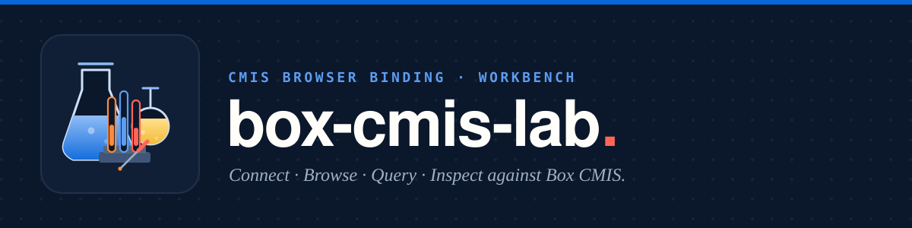

# box-cmis-lab

[](./LICENSE)


Modern **CMIS 1.1 Browser Binding** workbench — a web successor to Apache Chemistry
OpenCMIS Workbench. Connect to the
[Box CMIS Connector](https://github.com/unofficialbox/box-cmis-connector) (or any
Browser Binding endpoint), then browse, inspect, query, and download content.

UI chrome uses [`@unofficialbox/box-open-elements`](https://github.com/unofficialbox/box-open-elements).

> **Not affiliated with, authorized, or endorsed by Box, Inc.** "Box" is a
> trademark of Box, Inc. This is an independent community workbench.

## Quick start

### 1. Prerequisites

- [Bun](https://bun.sh) 1.3+
- A running CMIS Browser Binding endpoint (for Box, start
  [box-cmis-connector](https://github.com/unofficialbox/box-cmis-connector) on
  `http://127.0.0.1:8080/cmis`)
- A Box app (OAuth, CCG, or JWT) with access to the connector’s root folder

### 2. Install and run

```bash
git clone https://github.com/unofficialbox/box-cmis-lab.git
cd box-cmis-lab
bun install
cp .env.sample .env
bun run dev
```

Open [http://127.0.0.1:5173](http://127.0.0.1:5173).

### 3. Configure credentials

Edit `.env` (see [`.env.sample`](.env.sample)). Vite only exposes `VITE_*`
variables to the browser. Restart `bun run dev` after changes.

| Variable | Purpose |
| --- | --- |
| `VITE_CMIS_SERVICE_URL` | Browser Binding service URL (default `http://127.0.0.1:8080/cmis`) |
| `VITE_AUTH_MODE` | `oauth`, `ccg`, or `jwt` |
| `VITE_BOX_CLIENT_ID` / `VITE_BOX_CLIENT_SECRET` | Box app credentials |
| `VITE_OAUTH_REDIRECT_URI` | OAuth callback (default `http://127.0.0.1:5173/oauth/callback.html`) |
| `VITE_BOX_SUBJECT_TYPE` / `VITE_BOX_SUBJECT_ID` | CCG subject |
| `VITE_JWT_CONFIG_FILE` | Path to a Box JWT developer config `.json` (relative to project root) |

`.env` is gitignored — never commit secrets.

### 4. Connect in the UI

1. Open the account menu → **Connect**
2. Confirm the service URL (localhost is proxied through Vite’s `/cmis` path to avoid CORS)
3. Choose auth mode and fill credentials (or rely on `.env` defaults)
4. **Load repositories** → pick a repository → **Connect**

**OAuth tip:** register `http://127.0.0.1:5173/oauth/callback.html` on your Box
app. Token exchange is proxied via Vite (`/box-api` → `https://api.box.com`).

After connect, the Lab resumes the session on refresh when tokens (OAuth) or
`.env` credentials (CCG/JWT) are still available. **Disconnect** clears the
stored OAuth session.

## What you can do

- Browse the folder tree (name, base type, object id, last modified)
- Inspect object details: Object, Properties, ACL, Versions, Renditions
- Download document content streams
- Run CMIS SQL queries when `capabilityQuery` allows
- Watch live HTTP request/response traffic in the inspector

## Scripts

| Script | Purpose |
| --- | --- |
| `bun run dev` | Vite dev server with CMIS + Box API proxies |
| `bun run build` | Typecheck + production build |
| `bun run preview` | Preview the production build |
| `bun run typecheck` | TypeScript only |
| `bun run test` | Vitest unit tests |

## Project layout

```
src/
  app/         Shell, connect dialog, browse/details/query/inspector panels
  auth/        OAuth / CCG / JWT helpers and session resume
  cmis/        Browser Binding client + property helpers
  inspector/   Traffic log for the HTTP inspector
  session/     Connection and selection state
assets/        Banner and logo
docs/          Workbench parity notes
```

See [docs/workbench-parity.md](docs/workbench-parity.md) for a feature matrix
vs classic OpenCMIS Workbench.

## Related

- [box-cmis-connector](https://github.com/unofficialbox/box-cmis-connector) — CMIS 1.1 Browser Binding facade over Box
- [box-cmis-tck](https://github.com/unofficialbox/box-cmis-tck) — CMIS compatibility test kit
- [box-open-elements](https://github.com/unofficialbox/box-open-elements) — Web Components UI used by this lab

## License

[MIT](./LICENSE)
